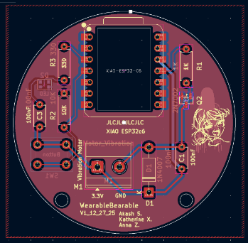
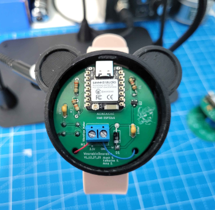
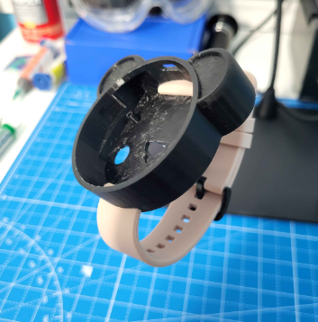

## Introduction

The Wearable Bearable is a prototype wearable haptic timing system that helps groups stay synchronized through shared vibration cues. It was originally developed for the **Interplay Orchestra**, a nonprofit ensemble for adults with disabilities, where some musicians may benefit from an additional tactile signal to reinforce the conductor’s tempo.

The system consists of one master device and one or more slave devices. A phone or other Bluetooth Low Energy (BLE) controller sends a selected tempo in beats per minute (BPM) to the master. The master converts that tempo into timed vibration pulses, activates its own motor, and broadcasts synchronization commands to nearby slaves using ESP-NOW. Each slave reproduces the same short vibration pulses, allowing all connected wearers to receive a coordinated tactile beat without physical connections between devices.

The project explores low-cost wearable haptic feedback as an accessibility tool for shared timing and coordination. The Wearable Bearable is a prototype and is not a medical device; it does not measure heart rate or diagnose, monitor, or treat any medical condition.

## Hardware

The custom KiCad PCB is built around the **Seeed Studio XIAO ESP32-C6** and includes:
- Vibration motor connection and MOSFET driver
- Flyback diode for motor protection
- WS2812B-2020 RGB LED
- Push button
- Supporting resistors and capacitors

The vibration motor is controlled through the MOSFET rather than directly from a GPIO pin, while the flyback diode protects the circuit from voltage spikes produced by the motor.

  

The PCB schematic, layout, component footprints, 3D models, and design backups are located in `KiCAD PCB/`.

## Enclosure

The electronics are housed inside a custom 3D-printed bear-shaped enclosure mounted to an adjustable wristband. The enclosure is designed to securely hold the PCB while allowing the vibration to be felt through the wrist or forearm.

  
  

The enclosure was designed in Onshape.

**Onshape Model:** [View CAD Design](https://cad.onshape.com/documents/7e5ceedf84fb8e6fbe93ee03/w/6ff0015e9bba8e7b5cdaebe4/e/c4b1ddca45680bea3a319f90?renderMode=0&uiState=6a83e70f9db896020d9f8f01)

## Firmware

The Arduino sketches are located in `ESP32c6 Code/`:
- `MasterCode.ino` receives a BPM value over BLE, controls the local vibration motor, and broadcasts the BPM using ESP-NOW.
- `SlaveCode.ino` receives the ESP-NOW command and reproduces the vibration rhythm.

A BPM value of `0` stops the rhythm. Values above `200` BPM are limited to `200`.

The planned communication system also includes support for device/group IDs, relay networking, and synchronization compensation so larger groups can remain coordinated even when some devices are outside the master’s direct range.

## Project Status

Wearable Bearable is currently an engineering prototype. The repository contains the PCB design, proof-of-concept firmware, Android control application, and 3D-printed wearable enclosure.

Planned features include expanded group management, relay networking, synchronization calibration, LED status indicators, and a more finalized communication protocol.

## Credits

Wearable Bearable was created by **Akash Saran**, **Katherine Xu**, and **Anna Zhou**.

Special Thanks: Credit to my best friend **Katherine Xu** for designing the **Bearable** React app (currently on Android) that controls the device and **Anna Zhou** for maintaining all communication efforts with Wearable's sponsors.

Special thanks to the **Interplay Orchestra** and Technical Director **Shri Khalpada** for supporting the project and providing feedback throughout development.

The repository includes component symbols, footprints, reference designs, and supporting assets from the **Seeed Studio Open Parts Library and Seeed Studio XIAO ecosystem**. Those third-party materials remain subject to their respective licenses and attribution requirements.

## Status

Project Originally Started: **10/17/2025**  
Github Saved: **8/18/2026**
